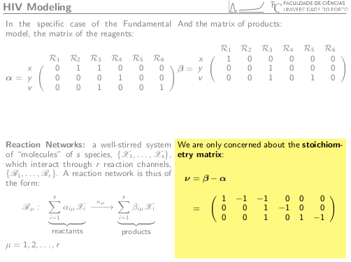

# beamer4

Slides have many advantages over the traditional blackboard or the more modern whiteboard. One advantage that they do not have is that information in whiteboards do not disapear instantly. This is very annoying for the audience.

The idea behind this simple script is to generate 4x4 grid beamer presentation where the last three slides are still visible.

Example:

